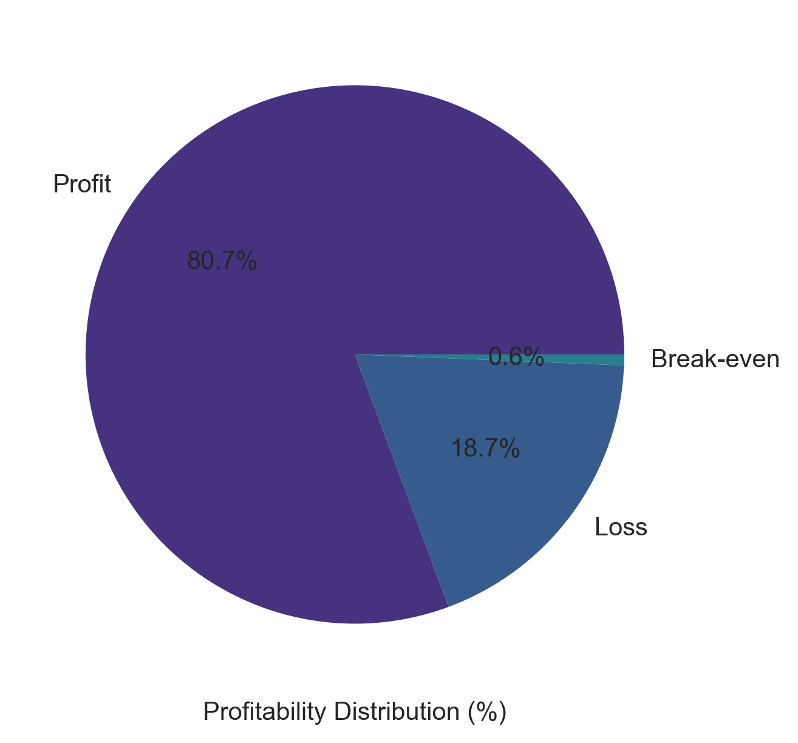
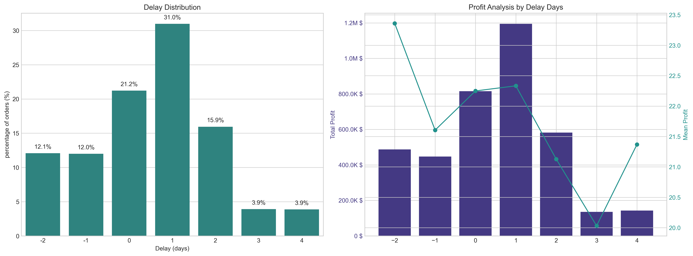
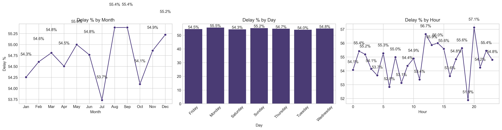

# Supply Chain Delay & Profit Analysis

## Overview
This project analyzes a supply chain dataset to understand delivery delays, identify bottlenecks, and study how delays affect profit.

---

## Tools Used
- Python  
- Pandas  
- NumPy  
- Matplotlib  
- Seaborn  

---

## Dataset
Dataset not included due to size.

(Add your dataset link here if available)

---

## Work Done

### Data Preparation
- Removed unnecessary columns  
- Handled missing values  
- Created new columns:
  - Delay  
  - Is_Delayed  
  - Order processing features  

---

### Analysis

- **Delay Distribution**
  - Calculated percentage of delayed orders  

- **Profit Analysis**
  - Compared profit with delay days  
  - Analyzed total and average profit
 

- **Bottleneck Detection**
  - Checked delay % across:
    - Shipping Mode  
    - Customer Segment  
    - Department  
    - Order Type
   

- **Root Cause Analysis**
  - Identified top factors contributing to delays by region

- **Time-Based Analysis**
  - Monthly trends  
  - Weekday trends  
  - Hourly patterns  

---

## Key Findings
- Delays impact profit  
- Some shipping modes have higher delay rates  
- Delays vary by region and category  
- Time patterns affect delivery performance  

---

## Conclusion
The analysis highlights areas where delivery performance can be improved and helps understand how delays affect overall operations.

---

## Author
Senjuti Maitra
